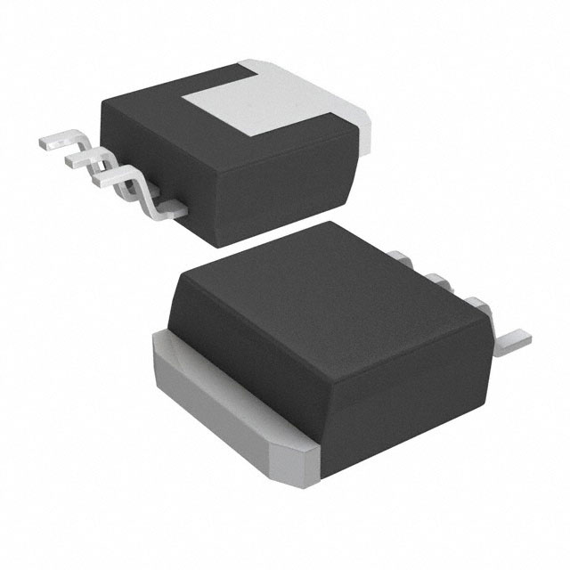

| **ESP32-S3-WROOM-1-N4**          |            |
|-------------------|--------------------|
| Product Page URL                              | [espressif](https://www.espressif.com/en/products/modules)                                                           | Found on Espressif.com |
| ESP32-S3-WROOM-1-N4 Datasheet URL             | [Datasheet](https://www.espressif.com/sites/default/files/documentation/esp32-s3-wroom-1_wroom-1u_datasheet_en.pdf)  |                        |
| ESP32 S3 Datasheet URL                        | [Datasheet](https://www.espressif.com/sites/default/files/documentation/esp32-s3_datasheet_en.pdf)                   | Has more detail on functions |
| ESP32 S3 Technical Reference Manual URL       | [Datasheet](https://www.espressif.com/sites/default/files/documentation/esp32-s3_technical_reference_manual_en.pdf)  | Has details on I/O multiplexing, USB, and others |

| **LM1086ISX-3.3/NOPB**          |            |
|-------------------|--------------------|
| Product Page URL                              | [Texas Instrument](https://www.ti.com/product/LM1086/part-details/LM1086ISX-3.3/NOPB) | Found on ti.com |
| LM1086 Datasheet URL                          | [Datasheet](https://www.ti.com/lit/ds/symlink/lm1086.pdf?HQS=dis-dk-null-digikeymode-dsf-pf-null-wwe&ts=1739050948904&ref_url=https%253A%252F%252Fwww.ti.com%252Fgeneral%252Fdocs%252Fsuppproductinfo.tsp%253FdistId%253D10%2526gotoUrl%253Dhttps%253A%252F%252Fwww.ti.com%252Flit%252Fgpn%252Flm1086) |

