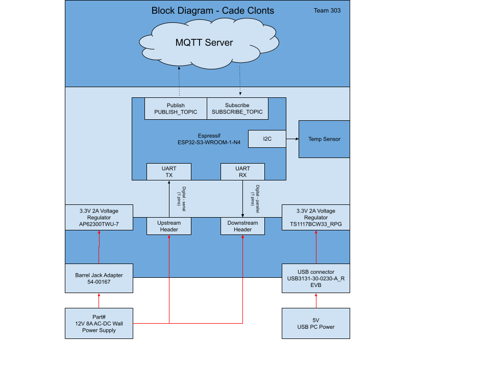

# Block Diagram

The system is centered around the **ESP32-S3-WROOM-1-N4 microcontroller**, which handles **Wi-Fi connectivity** for sending data to an **MQTT server** and **UART communication** for interfacing with external devices.

Power is supplied via two sources: a **12V, 8A input** (regulated to 3.3V using an **AP62300TWU-7 regulator**) and a **5V PC USB input** (regulated to 3.3V using a **TS1117BCW33_RPG regulator**). The 12V power is also distributed to an **8-pin connector** for external use.

UART communication is facilitated through **UART RX** (receiving data from downstream) and **UART TX** (transmitting data to upstream), enabling seamless data exchange with external devices. This setup provides a flexible and efficient platform for IoT applications.

---

