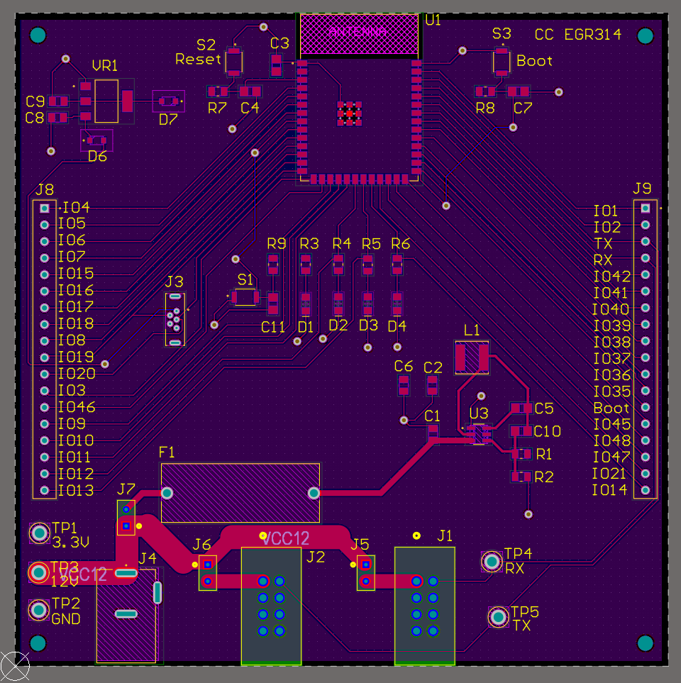

# Board Design

__The schematic below details the bidirectional communication system, ensuring reliable data transmission between components. This design incorporates several key sections, each serving a critical function in facilitating seamless communication.__

To support debugging and monitoring, the schematic includes three dedicated debug LEDs, providing visual indicators for data transmission and system status. Test points are strategically placed to allow for easy signal probing and troubleshooting. Additionally, reset and boot switches are integrated to enable system resets and firmware updates as needed.

A 3.3V voltage regulator is also included to ensure a stable power supply for the communication circuitry. This schematic meets user needs and product requirements by enabling efficient data exchange, supporting UART communication, and providing robust system diagnostics.

- [ZIP Project Folder](altium-project.zip)
- [Zip Gerber Files](gerber-files-cc-c1.2.zip)

## __Schematic__

- [Schematic PDF](altium-schematic.pdf)

## __PCB Design__
- [PCB PDF](PCB-design.pdf)

# Team Boards

## **Jahmel (HMI) Board**

## **Dan (Actuator) Board

## __Bill of Materials__

| Part Name/Description       | Manufacturer Part #     | Vendor Link                                                                 | Datasheet Link                                                                                     | Schematic Reference Designators |
|-----------------------------|-------------------------|-----------------------------------------------------------------------------|----------------------------------------------------------------------------------------------------|---------------------------------|
| Capacitor 22uF              | CL21A226MAYNNNE         | [Digikey](https://www.digikey.com/en/products/detail/samsung-electro-mechanics/CL21A226MAYNNNE/10479857) | [Datasheet](https://mm.digikey.com/Volume0/opasdata/d220001/medias/docus/339/CL21A226MAYNNNE_Spec.pdf) | C2,C6                           |
| Capacitor 10uF 0805         | GRM21BR61E106KA73L      | [Digikey](https://www.digikey.com/en/products/detail/murata-electronics/GRM21BR61E106KA73L/2334874) | [Datasheet](https://search.murata.co.jp/Ceramy/image/img/A01X/G101/ENG/GRM21BR61E106KA73-01.pdf)    | C1,C8,C9                        |
| Capacitor 0.1uF 0805        | CC0805KRX7R9BB104       | [Digikey](https://www.digikey.com/en/products/detail/yageo/CC0805KRX7R9BB104/302874) | [Datasheet](https://www.yageo.com/upload/media/product/productsearch/datasheet/mlcc/UPY-GPHC_X7R_6.3V-to-250V_24.pdf) | C3,C4,C5,C7,C10,C11             |
| Green LED 0805              | 150080VS75000           | [Digikey](https://www.digikey.com/en/products/detail/w%C3%BCrth-elektronik/150080VS75000/4489924) | [Datasheet](https://www.we-online.com/components/products/datasheet/150080VS75000.pdf)             | D1,D2,D3,D4                     |
| Red LED 0805                | 150080RS75000           | [Digikey](https://www.digikey.com/en/products/detail/w%C3%BCrth-elektronik/150080RS75000/4489918) | [Datasheet](https://www.we-online.com/components/products/datasheet/150080RS75000.pdf)             |                                 |
| Diode 0805                  | SD0805S020S1R0          | [Digikey](https://www.digikey.com/en/products/detail/kyocera-avx/SD0805S020S1R0/3749517) | [Datasheet](https://datasheets.kyocera-avx.com/schottky.pdf)                                       | D6,D7                           |
| 8 Pin header                | 702460801               | [Digikey](https://www.digikey.com/en/products/detail/molex/0702460801/760165) | [Datasheet](https://www.molex.com/en-us/products/part-detail/702460801?display=pdf)                | J1,J2                           |
| Usb connector               | USB3131-30-0230-A       | [Digikey](https://www.digikey.com/en/products/detail/gct/USB3131-30-0230-A/9859642) | [Datasheet](https://gct.co/files/specs/usb3131-spec.pdf)                                           | J3                              |
| Barrel Jack                 | 54-00167                | [Digikey](https://www.digikey.com/en/products/detail/tensility-international-corp/54-00167/10459295) | [Datasheet](https://tensility.s3.us-west-2.amazonaws.com/uploads/pdffiles/54-00167.pdf)            | J4                              |
| Jumper Female               | 15291026                | [Digikey](https://www.digikey.com/en/products/detail/molex/0015291026/315120) | [Datasheet](https://www.molex.com/pdm_docs/sd/015291026_sd.pdf)                                    | J5,J6,J7                        |
| Jumper Male                 | 68705-102HLF            | [Digikey](https://www.digikey.com/en/products/detail/amphenol-cs-fci/68705-102HLF/4403759) | [Datasheet](https://cdn.amphenol-cs.com/media/wysiwyg/files/documentation/datasheet/boardwiretoboard/bwb_bergstik.pdf) |                                 |
| Inductor 3.3uH              | VLS5045EX-3R3N          | [Digikey](https://www.digikey.com/en/products/detail/tdk-corporation/VLS5045EX-3R3N/5286683) | [Datasheet](https://product.tdk.com/system/files/dam/doc/product/inductor/inductor/smd/catalog/inductor_commercial_power_vls5045ex_en.pdf) | L1                              |
| Resistor 33.2k Ohm 0805     | RMCF0805FT33K2          | [Digikey](https://www.digikey.com/en/products/detail/stackpole-electronics-inc/RMCF0805FT33K2/1760489) | [Datasheet](https://www.seielect.com/catalog/sei-rmcf_rmcp.pdf)                                    | R1                              |
| Resistor 10k Ohm 0805       | RMCF0805FT10K0          | [Digikey](https://www.digikey.com/en/products/detail/stackpole-electronics-inc/RMCF0805FT10K0/1760676) | [Datasheet](https://www.seielect.com/catalog/sei-rmcf_rmcp.pdf)                                    | R2,R7,R8,R9                     |
| Resistor 100 Ohm 0805       | RMCF0805FT100R          | [Digikey](https://www.digikey.com/en/products/detail/stackpole-electronics-inc/RMCF0805FT100R/1760711) | [Datasheet](https://www.seielect.com/catalog/sei-rmcf_rmcp.pdf)                                    | R3,R4,R5,R6                     |
| Switch                      | B3U-1000P               | [Digikey](https://www.digikey.com/en/products/detail/omron-electronics-inc-emc-div/B3U-1000P/1534338) | [Datasheet](https://omronfs.omron.com/en_US/ecb/products/pdf/en-b3u.pdf)                           | SW1,SW2,SW3                     |
| Test Points                 | 5006                    | [Digikey](https://www.digikey.com/en/products/detail/keystone-electronics/5006/255330) | [Datasheet](https://www.keyelco.com/userAssets/file/M65p56.pdf)                                    | TP1,TP2,TP3,TP4,TP5             |
| ESP32                       | ESP32-S3-WROOM-1-N4     | [Digikey](https://www.digikey.com/en/products/detail/espressif-systems/ESP32-S3-WROOM-1-N4/16162639) | [Datasheet](https://www.espressif.com/sites/default/files/documentation/esp32-s3-wroom-1_wroom-1u_datasheet_en.pdf) | U1                              |
| Voltage Reg 5v-3v           | TS1117BCW33 RPG         | [Digikey](https://www.digikey.com/en/products/detail/taiwan-semiconductor-corporation/TS1117BCW33-RPG/7370078) | [Datasheet](https://services.taiwansemi.com/storage/resources/datasheet/TS1117B_I2405.pdf)          | U2                              |
| Voltage Reg 12v-3v          | AP62300TWU-7            | [Digikey](https://www.digikey.com/en/products/detail/diodes-incorporated/AP62300TWU-7/12702558) | [Datasheet](https://www.diodes.com/assets/Datasheets/AP62300_AP62301_AP62300T.pdf)                  | VR1                             |
| Fuse Holder                 | 4628                    | [Digikey](https://www.digikey.com/en/products/detail/keystone-electronics/4628/2137316) | [Datasheet](https://www.keyelco.com/userAssets/file/M65p44.pdf)                                    |                                 |
| Power Supply                |                         | [Amazon](https://www.amazon.com/ALITOVE-Converter-Transformer-5-5x2-1mm-Computer/dp/B07G5BQGYD/ref=sr_1_2_sspa?crid=12GWNG2FSE33T&dib=eyJ2IjoiMSJ9.OLbEbDloV-q56WykFU0853_wTKjxA9ZBbTQuOeOHqRyEtCI4ndhnJt2m8yiThbDHpUnWOYyze1BxgQevKLM6ofpUUL5-UIci3w9b_ygdyokWzLOQJR72hrt8FZ3wzlJIzn-pj2YHfjp49F9R6xqK_bP41X1ibJhGENpZhnj9C_yJsragRwC9fKnOHxm_Om_vAYwOYB7_N91D9optw7_FsEkMyenL13CHNszK6DaYqhA.ZkKFshn5vsOkEN1d93uqGDuIV8DB_UpzoR2mgmptFN0&dib_tag=se&keywords=power%2Badapter%2B12v%2B8A%2B2.5%2Bx%2B5.5&qid=1742561264&sprefix=power%2Badapter%2B12v%2B8a%2B2.5%2Bx%2B5.5%2Caps%2C131&sr=8-2-spons&sp_csd=d2lkZ2V0TmFtZT1zcF9hdGY&th=1) | [Datasheet](https://www.alitove.net/product/power-supply-adapter/12v-power-supply?product_id=68) |                                 |
| Temperature Sensor          | HiLetgo                 | [Amazon](https://www.amazon.com/dp/B07VNDZ6N4?ref=ppx_yo2ov_dt_b_fed_asin_title&th=1) |  [Datasheet](https://www.bosch-sensortec.com/media/boschsensortec/downloads/datasheets/bst-bmp280-ds001.pdf)                       |                                 |
| Ribbon Cable                |                         | [Amazon](https://www.amazon.com/gp/product/B07DFBPZLJ?smid=A64W1E1ZZHST0) |                                                                                                    |                                 |
| Fuse 2A                     |                         | [Digikey](https://www.digikey.com/en/products/detail/optifuse/TCC-2A/12090267) | [Datasheet](https://www.optifuse.com/optifuse_ecommerce_tools/datasheets/TCC.pdf)                  | F1                              |
| Header pins 18              |                         |                                                                             |                                                                                                    | J8,J9                           |

- [XLSX Files](bom.xlsx)

# **Function**
The Wi-Fi board schematic is designed to handle wireless communication between the system and a remote server, satisfying the need for real-time monitoring and control. Using an ESP32 microcontroller with built-in Wi-Fi, the board sends and receives data such as temperature readings and fan speed changes, enabling remote system feedback and updates.

A USB connection allows for programming and debugging via PC, supporting development and maintenance needs. A debug LED and button provide visual feedback and manual input for testing connectivity, messages, or firmware behavior. Header pins offer expandability for future functionality without redesigning the board.

Overall, the schematic meets user needs for wireless communication, remote data access, and flexible development support.

# **Design and Decision-Making Process**
The design approach followed a modular architecture to allow each board to fulfill a distinct role while maintaining clear communication interfaces. Early in the development process, the functionality was broken down into specific subsystems: sensing (temperature board), actuation (fan board), communication (Wi-Fi board), and interface (HMI board). Each schematic was developed to meet the requirements of its role while ensuring interoperability through consistent voltage levels and UART protocols.

Component selection prioritized compatibility with the ESP32 platform. UART was chosen as the inter-board communication protocol due to its simplicity, reliability, and sufficient speed for the low-bandwidth messaging required by the application. The threshold-based fan control logic was hardcoded for 34°C to ensure deterministic behavior, minimizing latency and enabling quick fan response.

Pin assignments, including GPIOs for UART and control signals, were mapped carefully to avoid conflicts across boards. Considerations were also given to power supply design, ensuring regulated 3.3V operation for the ESP32 and sensor components, with isolation between logic and power paths where necessary.

Decisions regarding HMI functionality involved balancing user control against automation. A button interface was incorporated to allow users to manually influence fan behavior, while the display serves as a feedback tool for system state—enhancing usability and transparency.

The schematic thus reflects a set of deliberate decisions rooted in system architecture, reliability, and user-centric interaction—all driven by clearly defined product requirements and user needs.

# **Version 2.0 Hardware Improvements**

Several enhancements can be made in a Version 2.0 hardware revision to improve usability, expandability, and overall system protection.

First, GPIO 17 and 18 should be used for UART RX and TX, respectively. These pins offer better compatibility with standard serial communication tools and reduce conflicts with other onboard functions. Utilizing these GPIOs would streamline debugging and communication with external devices.

Second, the inclusion of dedicated headers for 3.3V, 12V, and Ground would greatly improve power access for peripheral modules and simplify connections during testing or expansion. Clearly labeled power headers support modular development and ease system integration.

To improve protection, a diode should be added after the 12V regulator to prevent damage from reverse polarity connections. This simple safeguard enhances the durability and safety of the board, especially during frequent handling or field deployment.

Additionally, implementing a jumper on the USB power line would enable selective disconnection of USB power. This feature is useful when monitoring the ESP32’s behavior under different power configurations or when preventing back-powering issues in interconnected systems. It allows developers to isolate the power source and maintain safe operation across multiple boards.

These changes are directly supported by the schematic and address several practical limitations observed during the current hardware’s use. Incorporating these improvements would lead to a more robust, flexible, and reliable design suitable for both development and production environments.
