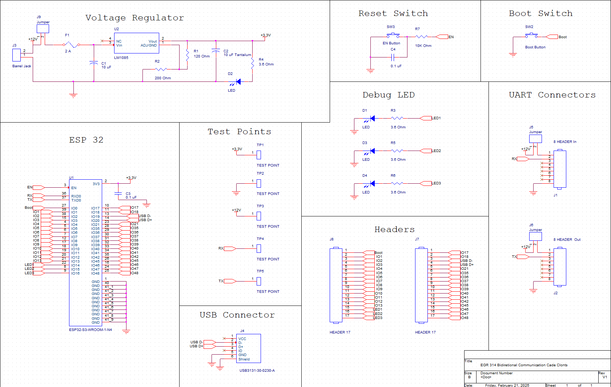

__The schematic below details the bidirectional communication system, ensuring reliable data transmission between components. This design incorporates several key sections, each serving a critical function in facilitating seamless communication.__

To support debugging and monitoring, the schematic includes three dedicated debug LEDs, providing visual indicators for data transmission and system status. Test points are strategically placed to allow for easy signal probing and troubleshooting. Additionally, reset and boot switches are integrated to enable system resets and firmware updates as needed.

A 3.3V voltage regulator is also included to ensure a stable power supply for the communication circuitry. This schematic meets user needs and product requirements by enabling efficient data exchange, supporting UART communication, and providing robust system diagnostics.

### __Schematic__

### __Download Links__
- [PDF](EGR314-Schematic.pdf)
- [ZIP Cadence Folder](EGR-314-PRJT-CC.zip)

### __PCB Design__

Coming Soon

### __Power Budget__

[Power Budget](power-budget.png)
