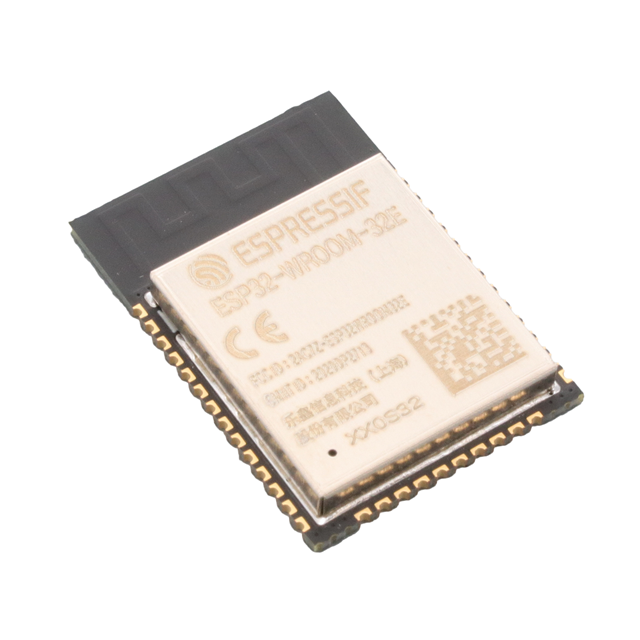
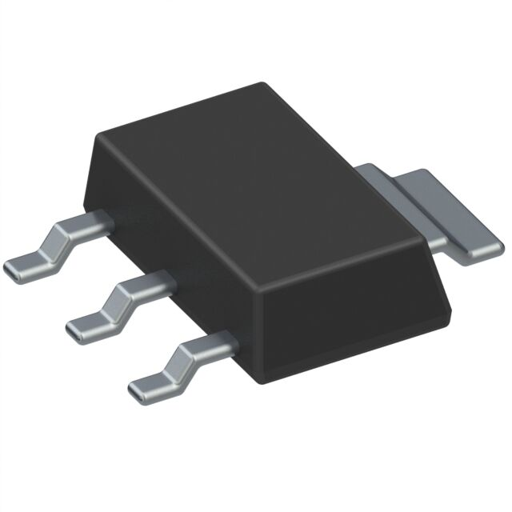
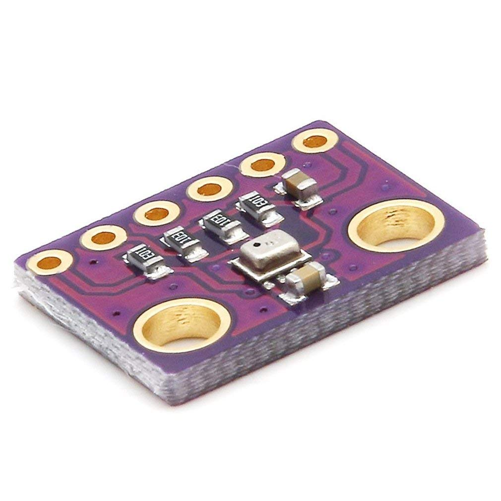
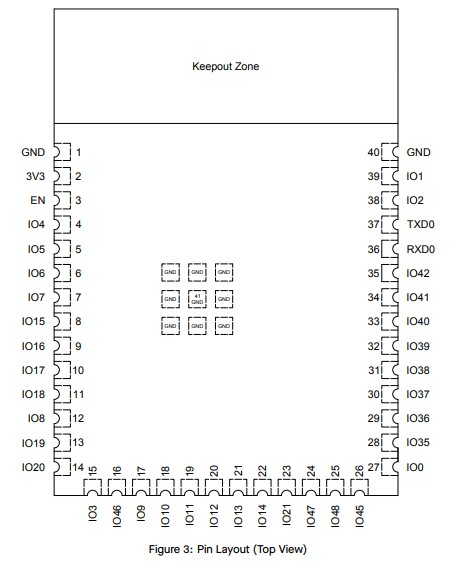
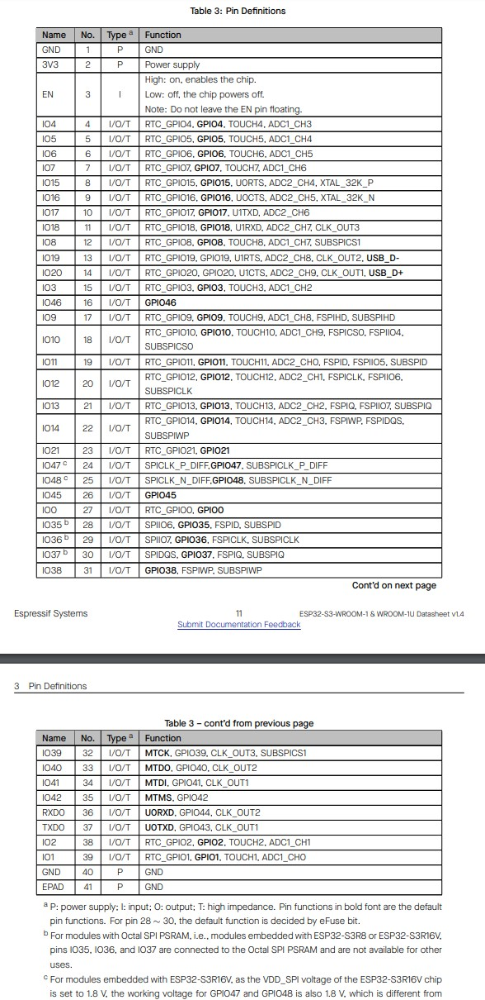

# Component Selection

## **Microcontroller**

| **Solution**       | **Pros**    | **Cons**                          |
| ------------------ | ----------- | --------------------------------- |
|  Option 1.  **ESP32-S3-WROOM-1-N4**  $2.95/each [link to product](https://www.digikey.com/en/products/detail/espressif-systems/ESP32-S3-WROOM-1-N4/16162639) | Versatile   Wifi and Bluetooth   Meets surface mount constraint of project | No Dedicated SRAM |
|   Option 2.   ESP32-S3-WROOM-1-N16R8   $3.90/each   [Link to product](https://www.digikey.com/en/products/detail/espressif-systems/ESP32-S3-WROOM-1-N16R8/16162642) | 16MB of memory   Wifi and Bluetooth |  More expensive   Slow shipping speed |
|   Option 3.   ESP32-WROOM-32E-H4   $2.68/each   [Link to product](https://www.digikey.com/en/products/detail/espressif-systems/ESP32-WROOM-32E-H4/12696413) |  Wider operating temperature range   Wifi and Bluetooth |  Low Inventory   Slow shipping speed |

**Choice:** Option 1: ESP32-S3-WROOM-1-N4.

**Rationale:** The ESP32-S3-WROOM-1-N4 is the optimal choice because it provides a balance of features, cost, and compatibility with the project requirements. Its integrated Wi-Fi and Bluetooth v5.0 capabilities, surface mount design, and sufficient memory make it ideal for bidirectional internet communication. While it has some limitations, such as limited RAM and a moderate operating temperature range, these are not critical for the project.

---

## **USB Connector**

| **Solution**       | **Pros**    | **Cons**                          |
| ------------------ | ----------- | --------------------------------- |
|   Option 1.   E10118193-0001LF $0.41/each [link to product](https://www.digikey.com/en/products/detail/amphenol-cs-fci/10118193-0001LF/2785388)  | Right Angle Mounting   Through hole and SMD Mounting   Shielded | Through hole and SMD complexity |
|   Option 2.   10118192-0002LF   $0.38/each   [Link to product](https://www.digikey.com/en/products/detail/amphenol-cs-fci/10118192-0002LF/6817756) | Right Angle Mounting   Shielded | More expensive   7 Week Lead Time |
|   **Option 3.**   USB3140-30-0170-1-C   $0.77/each   [Link to product](https://www.digikey.com/en/products/detail/gct/USB3140-30-0170-1-C/9859645) | Wider operating temperature range   Shielded | SMD Mounting only   Vertical Mounting |

**Choice:** Option 1: USB3140-30-0170-1-C.

**Rationale:** The USB3140-30-0170-1-C is the optimal choice because it provides a balance of high current handling, robust shielding, and mounting flexibility. Its 10,000 mating cycles and wide operating temperature range ensure durability and reliability

---

## **Linear Voltage Regulator**

| **Solution**       | **Pros**    | **Cons**                          |
| ------------------ | ----------- | --------------------------------- |
|  Option 1.  NCP5662DS33R4G  $1.32/each   [link to product](https://www.digikey.com/en/products/detail/onsemi/NCP5662DS33R4G/1483762)                 |Over-Current Protection   Enable Pin  | Obsolete Status   Bulk Quantity Ordering |
|   Option 2.   TPS75133QPWPR   $4.12/each   [Link to product](https://www.digikey.com/en/products/detail/texas-instruments/TPS75133QPWPR/1673042) | Wide Temp Range   Advance Features (Reset Pin, etc.) | Low Dropout Voltage   Input Voltage 5.5 |
|   Option 3.   NCP565MN33T2G   $0.89/each   [Link to product](https://www.digikey.com/en/products/detail/onsemi/NCP565MN33T2G/1792550) | Compact Design   Wide Temperature Range | Difficult SMD mounting   Obsolete Status |
|   **Option 4.**   AP62300TWU-7   $0.71/each   [Link to product](https://www.digikey.com/en/products/detail/diodes-incorporated/AP62300TWU-7/12702558) | Larger Package Size   Wide Voltage Input Range (4.2V - 18V)   High Efficiency | 85°C Top Temperature |
|   **Option 5.**   TS1117BCW33 RPG   $0.82/each   [Link to product](https://www.digikey.com/en/products/detail/taiwan-semiconductor-corporation/TS1117BCW33-RPG/7370078) | Fixed 3.3V Output   Simple Design   Overcurrent & Thermal Protection   | High Dropout Voltage   Lower Efficiency |

**Choice:** Option 4 & 5: AP62300TWU-7; TS1117BCW33 RPG

**Rationale:** The combination of the **AP62300TWU-7** and **TS1117BCW33 RPG** provides a versatile power regulation solution. The AP62300TWU-7, a high-efficiency buck converter, efficiently steps down higher input voltages (4.2V - 18V) while delivering up to 3A output current, making it ideal for applications requiring higher power efficiency. However, its switching nature may introduce noise.

The TS1117BCW33 RPG, a low-dropout (LDO) regulator, provides a clean and stable 3.3V output with built-in overcurrent and thermal protection, making it well-suited for noise-sensitive components and 5V PC Programming. Though less efficient than the buck converter, its simplicity and low dropout performance (for lower currents) make it a good secondary choice.

---

## **Temp Sensor**
| **Solution**       | **Pros**    | **Cons**                          |
| ------------------ | ----------- | --------------------------------- |
|  Option 1.  BMP280-3.3  $1.48/each   [link to product](hhttps://www.amazon.com/dp/B07VNDZ6N4?ref=ppx_yo2ov_dt_b_fed_asin_title&th=1)                 |Premade   Pins for breadboarding   Accuracy   Multiple Features  | Amazon has no datasheet |

# **Final Components**

| **USB3140-30-0170-1-C**          | **Link**   |
|---------------------------------|------------|
| Product Page URL                              | [DigiKey](https://www.digikey.com/en/products/detail/gct/USB3131-30-0230-A/9859642) | Found on DigiKey.com |
| USB Datasheet URL                          | [Datasheet](https://gct.co/files/specs/usb3131-spec.pdf) |

| **AP62300TWU-7**          | **Link**   |
|---------------------------------|------------|
| Product Page URL                              | [DigiKey](https://www.digikey.com/en/products/detail/diodes-incorporated/AP62300TWU-7/12702558) | Found on DigiKey.com |
| LM1086 Datasheet URL                          | [Datasheet](https://www.diodes.com/assets/Datasheets/AP62300_AP62301_AP62300T.pdf) |

| **TS1117BCW33 RPG**          | **Link**   |
|---------------------------------|------------|
| Product Page URL                              | [DigiKey](https://www.digikey.com/en/products/detail/taiwan-semiconductor-corporation/TS1117BCW33-RPG/7370078) | Found on DigiKey.com |
| LM1086 Datasheet URL                          | [Datasheet](https://services.taiwansemi.com/storage/resources/datasheet/TS1117B_I2405.pdf) |

| **BMP280-3.3**          | **Link**   |
|---------------------------------|------------|
| Product Page URL                              | [Amazon](https://www.amazon.com/dp/B07VNDZ6N4?ref=ppx_yo2ov_dt_b_fed_asin_title&th=1) | Found on Amazon.com |
| USB Datasheet URL                          | [Datasheet](https://www.bosch-sensortec.com/media/boschsensortec/downloads/datasheets/bst-bmp280-ds001.pdf) |

| ESP Info                                      | Answer |
| --------------------------------------------- | ------ |
| Model                                         | ESP32-S3-WROOM-1-N4      |
| Product Page URL                              | [Product Page](https://www.digikey.com/en/products/detail/espressif-systems/ESP32-S3-WROOM-1-N4/16162639)|
| ESP32-S3-WROOM-1-N4 Datasheet URL             | [Datasheet](https://www.espressif.com/sites/default/files/documentation/esp32-s3-wroom-1_wroom-1u_datasheet_en.pdf)|
| Reference Manual                              | [Reference Manual](https://www.espressif.com/sites/default/files/documentation/esp32-s3_technical_reference_manual_en.pdf)|
| Vendor link                                   | [Digikey](https://www.digikey.com/en/products/detail/espressif-systems/ESP32-S3-WROOM-1-N4/16162639)      |
| Code Examples                                 | [Code Examples](https://github.com/espressif/esp-idf/tree/master/examples)      |
| External Resources URL(s)                     | [External Resources](https://esp32io.com/tutorials/esp32-code-structure)      |
| Unit cost                                     | $2.95      |
| Absolute Maximum Current for entire IC        | 500mA      |
| Supply Voltage Range                          | 3.0-3.6V      |
| Maximum GPIO current (per pin)                | 40mA      |
| Supports External Interrupts?                 | Yes      |
| Required Programming Hardware, Cost, URL      | ESP32-S3 is programmable through USB OTG|

| Module         | # Available | Needed | Associated Pins (or * for any) |
| -------------- | ----------- | ------ | ------------------------------ |
| Power          | 2           | 2      | 3V3, EN                        |
| Ground         | 2           | 2      | GND, GND                       |
| UART           | 3           | 2      |GPIO43 ~ GPIO44, GPIO17 ~ GPIO18|
| External SPI   | 4           | 0      | N/A                            |
| I2C            | 2           | 0      | N/A                            |
| GPIO           | 45          | 4      | *                              |
| ADC            | 2           | 0      | N/A                            |
| LED PWM        | 5           | 5      | *                              |
| Motor PWM      | 0           | 0      | N/A                            |
| USB Programmer | 1           | 1      | GPIO19 ~ GPIO20                |

