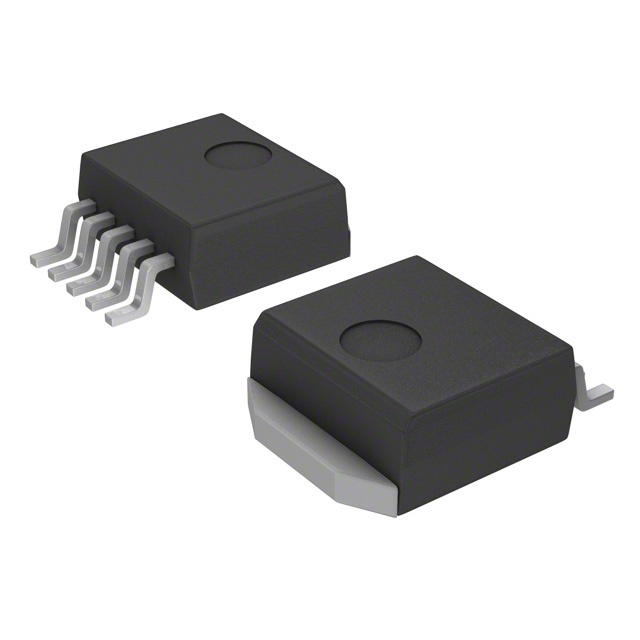

## Team Role
My role in the team is the bidirectional internet communication subsystem using MQTT protocol. For this subsystem, I will be using an ESP32-S3-WROOM-1-N4 module mounted on a custom PCB. This system will facilitate communication between the sensor, actuator, and human interface subsystems through UART connections. A UART connection will also be implemented for the human interface, complementing the wireless interface device that communicates over the MQTT protocol. This subsystem will be responsible for sending and receiving data over MQTT with the human interface device and transferring sensor and actuator data. My focus will be on maintaining smooth and reliable data flow across the system, enabling precise interaction between the different subsystems.

## Component Selection

*Table 1*

**Microcontroller**

| **Solution**                                                                                                                                                                                      | **Pros**                                                                                                                                    | **Cons**                                                                                            |
| ------------------------------------------------------------------------------------------------------------------------------------------------------------------------------------------------- | ------------------------------------------------------------------------------------------------------------------------------------------- | --------------------------------------------------------------------------------------------------- |
|  Option 1.  ESP32-S3-WROOM-1-N4 $2.95/each [link to product](https://www.digikey.com/en/products/detail/espressif-systems/ESP32-S3-WROOM-1-N4/16162639?s=N4IgjCBcpgbFoDGUBmBDANgZwKYBoQB7KAbRACY4BWWAFhAF0CAHAFyhAGVWAnASwB2AcxABfAlXrQQySOmz4ipELADsVVQE4AHIxbtIXXoJHiVmhDNSZcBYpDK0ADJoDMbvSDYdu-YWIIwd0tZeVslB3ByTU1yck9vQ18TAPBaeOlQm0V7MlVyV21XeiYvAyM-UwJyKgykawU7ZUpyWEoE8uT-M3JVeEyG8NyKJ3JtdtLEipSzVyd%2B%2Brlspsig7U0NDp9jboJaWl0BpcaIsjAnJ1c%2BraSdqpANQ8WwnObtNRob6d2Qcaln5anFTqLTwSadO6pcYLKzHIbKD5aKhfLr3TSwZFHF4rMiFKjzJwoyFmHT-WHYoGSbRUTQQcHbSqpMDacYhQavVZExlmZlFNlwjm48hOVTaEr6BkzQIsslZE7DLTaXlcqXgHQWLGA4aEhg9WCaVT8ikK-G0Wkqn4AWggmvlyjAmicJTMltl7JxIE0zhqjBdmIBds51RA1Vorl9BEthtt8MisDmsFg2jwDqdvtEoiAA)                 | \* Versatile  \* Wifi and Bluetooth \* Meets surface mount constraint of project                                               | \* No Dedicated SRAM |
|  \* Option 2.  \* ESP32-S3-WROOM-1-N16R8  \* $3.90/each  \* [Link to product](https://www.digikey.com/en/products/detail/espressif-systems/ESP32-S3-WROOM-1-N16R8/16162642) | \* 16MB of memory  \* Wifi and Bluetooth | * More expensive  \* Slow shipping speed |
| .jpg) \* Option 3.  \* ESP32-WROOM-32E-H4  \* $2.68/each  \* [Link to product](https://www.digikey.com/en/products/detail/espressif-systems/ESP32-WROOM-32E-H4/12696413) | \* Wider operating temperature range  \* Wifi and Bluetooth | * Low Inventory  \* Slow shipping speed |

**Choice:** Option 1: ESP32-S3-WROOM-1-N4.

**Rationale:** The ESP32-S3-WROOM-1-N4 is the optimal choice because it provides a balance of features, cost, and compatibility with the project requirements. Its integrated Wi-Fi and Bluetooth v5.0 capabilities, surface mount design, and sufficient memory make it ideal for bidirectional internet communication. While it has some limitations, such as limited RAM and a moderate operating temperature range, these are not critical for the project.

*Table 2*

**USB Connector**

| **Solution**                                                                                                                                                                                      | **Pros**                                                                                                                                    | **Cons**                                                                                            |
| ------------------------------------------------------------------------------------------------------------------------------------------------------------------------------------------------- | ------------------------------------------------------------------------------------------------------------------------------------------- | --------------------------------------------------------------------------------------------------- |
|  Option 1.  E10118193-0001LF $0.41/each [link to product](https://www.digikey.com/en/products/detail/amphenol-cs-fci/10118193-0001LF/2785388)  | \* Right Angle Mounting  \*Through hole and SMD Mounting  \* Shielded | \* Through hole and SMD complexity |
|  \* Option 2.  \* 10118192-0002LF  \* $0.38/each  \* [Link to product](https://www.digikey.com/en/products/detail/amphenol-cs-fci/10118192-0002LF/6817756) | \* Right Angle Mounting  \* Shielded | * More expensive  \* 7 Week Lead Time |
|  \* Option 3.  \* USB3140-30-0170-1-C  \* $0.77/each  \* [Link to product](https://www.digikey.com/en/products/detail/gct/USB3140-30-0170-1-C/9859645) | \* Wider operating temperature range  \* Shielded | * SMD Mounting only  \* Vertical Mounting |

**Choice:** Option 1: 10118193-0001LF.

**Rationale:** The 10118193-0001LF is the optimal choice because it provides a balance of high current handling, robust shielding, and mounting flexibility. Its 10,000 mating cycles and wide operating temperature range ensure durability and reliability

*Table 3*

**Linear Voltage Regulator**

| **Solution**                                                                                                                                                                                      | **Pros**                                                                                                                                    | **Cons**                                                                                            |
| ------------------------------------------------------------------------------------------------------------------------------------------------------------------------------------------------- | ------------------------------------------------------------------------------------------------------------------------------------------- | --------------------------------------------------------------------------------------------------- |
|  Option 1.  NCP5662DS33R4G $1.32/each [link to product](https://www.digikey.com/en/products/detail/onsemi/NCP5662DS33R4G/1483762)                 | \* Over-Current Protection  \* Enable Pin  | \* Obsolete Status  \* Bulk Quantity Ordering |
|  \* Option 2.  \* TPS75133QPWPR  \* $4.12/each  \* [Link to product](https://www.digikey.com/en/products/detail/texas-instruments/TPS75133QPWPR/1673042) | \* Wide Temp Range  \* Advance Features (Reset Pin, etc.) | * Low Dropout Voltage  \* Input Voltage 5.5 |
| .jpg) \* Option 3.  \* NCP565MN33T2G  \* $0.89/each  \* [Link to product](https://www.digikey.com/en/products/detail/onsemi/NCP565MN33T2G/1792550) | \* Compact Design  \* Wide Temperature Range | * Difficult SMD mounting  \* Obsolete Status |
| .jpg) \* Option 3.  \* LM1086ISX-3.3/NOPB  \* $1.98/each  \* [Link to product](https://www.digikey.com/en/products/detail/texas-instruments/LM1086ISX-3-3-NOPB/366718) | \* Larger Package Size  \* Wide Voltage Input Range | * High Dropout Voltage |

**Choice:** Option 4: LM1086ISX-3.3/NOPB.

**Rationale:** The LM1086ISX-3.3/NOPB is the optimal choice because it provides a balance of wide input voltage range, high current output, and robust protection features. Its wide operating temperature range ensures stable and reliable operation in various environments. Although it has a higher dropout voltage and quiescent current, these are outweighed by its performance and reliability, making it the best fit for the project.
