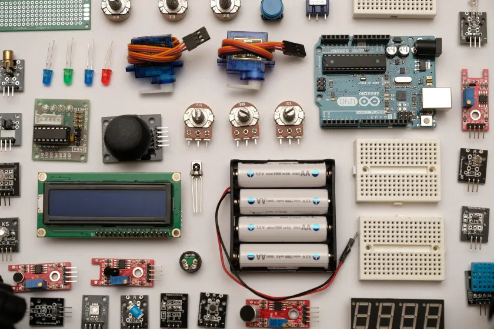

# EGR 314 - Embedded System Design Project II

## STEM Weather Station Project

**Team Number:** 303  

**Team Members:** Dan, Tyler, Jahmel 

**Preparation Date:** Febuary 8, 2025  

**Semester and Year:** Spring 2025  

**University:** Arizona State University 

**Professor:** K. Nichols

## Team Role
My role in the team is the bidirectional internet communication subsystem using MQTT protocol. For this subsystem, I will be using an ESP32-S3-WROOM-1-N4 module mounted on a custom PCB. This system will facilitate communication between the sensor, actuator, and human interface subsystems through UART connections. A UART connection will also be implemented for the human interface, complementing the wireless interface device that communicates over the MQTT protocol. This subsystem will be responsible for sending and receiving data over MQTT with the human interface device and transferring sensor and actuator data. My focus will be on maintaining smooth and reliable data flow across the system, enabling precise interaction between the different subsystems.
